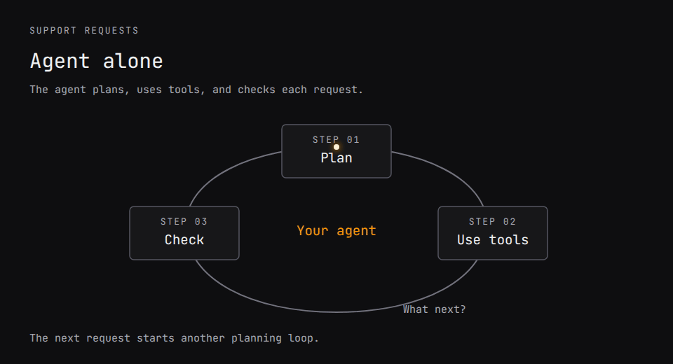

# agent.run()

**Add Jev-powered workflows to your agents.**

AgentRun is a workflow language for the agents you already run. Define repeatable steps, use [Jev](https://docs.typesafe.ai/) for focused decisions, and call an agent when the work needs investigation. Your application keeps its tools, model access, permissions, and budgets.

[Quickstart](#quickstart) · [Documentation](docs/guide.md) · [Examples](docs/examples.md) · [Pi extension](#use-it-in-pi) · [Agent instructions](docs/agent-instructions.md)



[View the static diagram](docs/assets/support-workflow.svg) · [Run this example](#run-the-support-example)

- **Reuse known steps.** Put a repeatable procedure in a workflow and call an agent when a step needs investigation.
- **Make decisions explicit.** Jev returns typed answers and probabilities. Your workflow sets the thresholds and fallback.
- **Test the procedure.** Validate inputs and outputs, test individual steps, and bound parallel work, retries, and loops.

## Quickstart

Requires **Node 22.19+** and npm. In your project:

```sh
npm install @parcha/agentrun-dsl@beta
npx agentrun demo
```

This small ticket-routing demo runs without an API key. It uses scripted Jev decisions to show the workflow's steps and result. [Use it in Pi](#use-it-in-pi) to build workflows with your agent.

### Run the support example

To run the workflow in the animation, clone the examples and build:

```sh
git clone --branch main --single-branch https://github.com/Parcha-ai/agentrun.git
cd agentrun
# With nvm: nvm install && nvm use
npm ci --ignore-scripts
npm run build
npm run demo:support
```

This runs the actual DSL interpreter with **scripted tools, Jev answers, and agent responses**. No API key or model access is needed. It checks execution, not model quality, and sends no customer replies.

The command prints a report for each case:

| Request | Agent calls | Decision calls | Result |
| --- | ---: | ---: | --- |
| Reset a password | 0 | 1 | Return the help answer |
| Find an invoice | 0 | 1 | Return the help answer |
| Investigate a failed payment | 1 | 2 | Return the checked investigation |
| Payment still unresolved | 1 | 2 | Escalate for review |

```sh
npm run demo:support -- payment
npm run test:support
```

To see the stop path, run `npm run demo:support -- unresolved`. It exits with code `2`; the all-cases demo exits `0` when every expected outcome matches. Scripted responses do not adapt when you change the prompts.

[Connect live Jev and your agent](docs/support-quickstart.md), or [give these instructions to your coding agent](docs/agent-instructions.md).

## What a workflow looks like

The [support workflow](examples/support-answer.mjs) searches for an answer, asks Jev whether it resolves the request, and investigates only if needed. A nonempty answer with a source reference and a `yes` with confidence of at least `0.8` passes. Otherwise, one agent attempt is allowed, followed by a second Jev check. An unresolved result escalates.

These are the search and decision nodes from that workflow:

```js
{
  node: 'call', label: 'find-answer', via: 'tool',
  tool: 'help.search', args: { request: '{request}' },
  out: 'Candidate', as: 'answer', deadline_s: 10,
},
{
  node: 'judge', label: 'check-existing-answer',
  state: { request: '{request}', answer: '{answer}' },
  out: 'Fit', as: 'fit',
}
```

`Candidate` and `Fit` refer to schemas in the workflow. `Fit` defines the question and its `yes`, `no`, and `uncertain` criteria. Code reads the decision and its confidence to choose the next step. [Read the complete definition, including the agent and review path](examples/support-answer.mjs).

This small domain-specific language (DSL) can be authored as JSON or with the [TypeScript builder and Zod contracts](docs/authoring.md). The builder infers input and output types; intermediate state paths are checked at runtime. Workflows can call other workflows, map work in parallel, and run bounded loops.

## Connect your application

Install the core and Jev adapter in your application with `npm install @parcha/agentrun-dsl@beta @parcha/agentrun-jev@beta`. Then:

1. **Supply adapters.** Connect tools through `runEffect`, your existing agent through `runNode`, and Jev decisions through `createJevRunner()` as `runJudge`.
2. **Define and test the workflow.** Write its schemas, steps, thresholds, and review path. Start with fixtures, then evaluate real decisions on labeled cases from your task.
3. **Expose it to your agent.** Wrap a workflow run as a tool in your application. Your agent can call that procedure when needed and use its validated output or escalation result.

For live Jev calls, reuse `TYPESAFE_API_KEY` from the server environment. If it is missing, get a key from the [TypeSafe dashboard](https://console.typesafe.ai/keys) and follow the [Jev quickstart](https://docs.typesafe.ai/introduction/quickstart). A coding-agent login does not provide this key. Keep credentials out of prompts and source control.

The [support integration guide](docs/support-quickstart.md) includes the config template, live command, and expected call sequence. The [host integration guide](docs/host-integration.md) explains permissions, cancellation, recovery, and existing-interpreter compatibility. Jev is optional for workflows without decision nodes.

## Use it in Pi

With [Pi 0.87.0 installed](packages/pi/README.md#install), run these commands in your project:

```sh
pi install npm:@parcha/agentrun-pi@0.1.0-beta.2 -l
pi --offline
```

`-l` installs in this project; omit it to install for all Pi sessions. `--offline` skips Pi startup downloads. On first launch, Pi asks whether you trust the project before loading its extension. No AgentRun checkout is needed.

- `/agentrun demo` loads the scripted research example; `/agentrun run` repeats it without model calls.
- `/agentrun demo live` uses your configured Pi model and Jev.
- `/agentrun status` checks setup; `/agentrun` shows the graph; `/agentrun stop` requests cancellation.

Once Pi has model access, ask it to build a workflow:

```text
/agentrun Research how this repository handles cancellation. Investigate the runtime and tests separately, then report gaps with file references.
```

Pi uses the packaged skill to build, inspect, and run the workflow. If Pi is already open, run `/reload` after installing. Workflows stay in memory for the current session; `/reload` clears the current definition. Saving them for later is planned for V2. [Pi setup and limits](packages/pi/README.md).

## More examples

| Example | What it demonstrates |
| --- | --- |
| [Support answers](docs/support-quickstart.md) | Search, Jev checks, optional investigation, review fallback |
| [Research a decision](examples/typed-research.ts) | Nested workflows, parallel research, evidence selection, report writing |
| [Standalone TypeScript starter](examples/starter/README.md) | Install the packages in your own app; search and screen evidence |

<a id="run-it"></a>

### Research demo

The existing `npm run demo` command runs the scripted research workflow: “Should our team move its docs from a wiki into the code repository?” It prints a workflow preview, then researches three subquestions and retains three sources. Expected calls: three tools, three system one decisions, and five model steps.

```sh
npm run demo
npm run test:typed-example
npm run eval:research
```

`npm run demo -- --no-evidence` stops before writing findings or a report and exits `2`. Only the planning model step runs. The evaluation checks six labeled cases with scripted responses. [Connect real Jev and Pi models](docs/live-research.md).

## Packages, status, and contributing

| Package | Responsibility |
| --- | --- |
| [`@parcha/agentrun-dsl`](packages/dsl/README.md) | Define, validate, inspect, and execute workflows |
| [`@parcha/agentrun-jev`](packages/jev/README.md) | Connect Jev typed decisions |
| [`@parcha/agentrun-pi`](packages/pi/README.md) | Pi extension and agent runner |

`0.1.0-beta.2` is published on npm. See [release instructions](docs/releasing.md), [contracts and limits](docs/guide.md#limits), and the [contribution guide](CONTRIBUTING.md). The website is maintained separately.

Ordinary functions may be enough for a small fixed sequence. AgentRun adds a reusable workflow document with explicit execution rules. Code nodes execute JavaScript with process privileges; untrusted workflow authors require a host-controlled sandbox. Typed decisions and validated output shapes do not prove that an answer is factually correct.

To contribute, install the checkout, make a focused change, and run `npm run check` and `npm run verify:packages`. [Open an issue](https://github.com/Parcha-ai/agentrun/issues) for bugs or proposals.

Code and documentation use [Apache-2.0](LICENSE). Copyright 2026 Parcha Labs, Inc. Dependencies retain their own licenses. Built by [Grep.ai](https://grep.ai).
